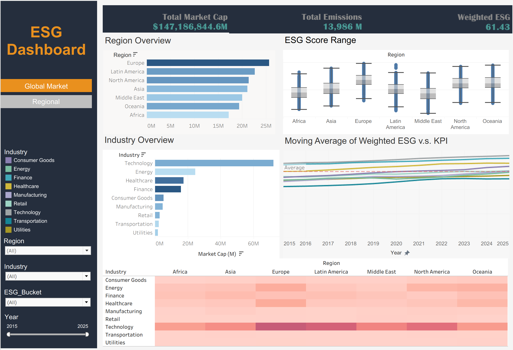

# Company ESG Tableau Dashboard

## 📊 Dashboard Overview

### Global ESG Dashboard  

### Regional ESG Dashboard  

👉 **Click here to view the full interactive dashboard on Tableau Public:**  
https://public.tableau.com/shared/CQJRNJP6B?:display_count=n&:origin=viz_share_link

---

## 📌 Project Overview
This Tableau project provides an in-depth analysis of ESG performance in relation to financial metrics across industries.  
The goal of this dashboard is to help users explore ESG patterns, regional differences, and financial correlations through interactive visualizations.

## 🎯 Key Objectives
- Analyze ESG scores across different regions and industries  
- Compare ESG performance with financial indicators such as market cap and emissions  
- Provide an interactive and user-friendly dashboard for deeper insight exploration  
- Visualize trends and differences over time  

## 📈 Dashboard Features
- Regional ESG score distributions  
- Industry-level financial and ESG comparisons  
- Moving average trends of weighted ESG vs. KPI  
- Interactive filters for region, industry, ESG bucket, and year  
- Heatmap to highlight ESG performance patterns  

---

If you found this project useful or interesting, feel free to explore the rest of my GitHub portfolio!
